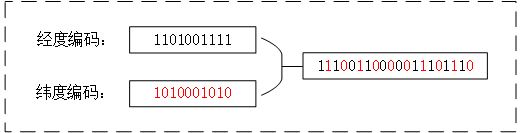
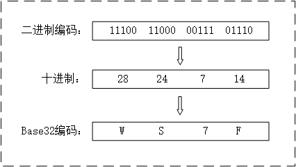
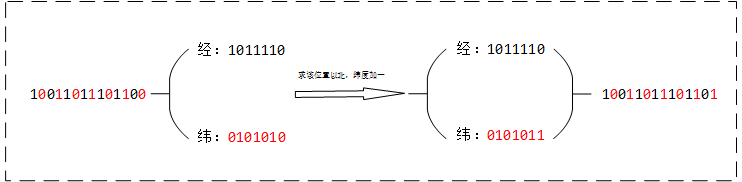
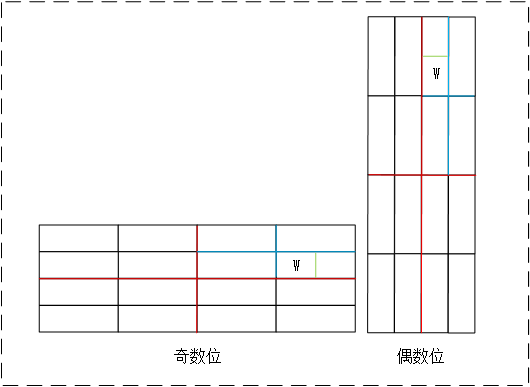
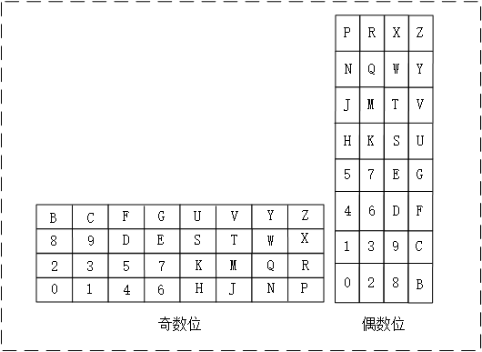
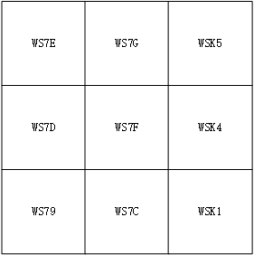
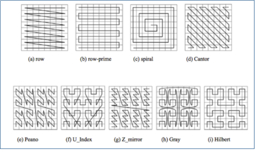

# 【搬砖笔记】 利用GeoHash为地理位置编码

## 一、前言

最近有个需求，要计算出客户坐标附近5公里的所有门店，并按照步行距离排序。

最直接的方法就是遍历该城市下的所有门店，但是该方法明显不可取，因为在门店数量巨大，且还需要计算步行距离并排序的情况下，时间复杂度过高。

突然想到当年做图像遇见一个问题：给定一个视频中连续的三千帧，但是已经乱序，告诉你第一帧，将这三千帧进行排序。遍历图像的所有像素点同样不可取，当时的解决方案是利用感知哈希计算出所有图像的指纹，接着利用明氏距离计算距离第一张最近的图像作为第二张，然后计算距离第二张最近的作为第三张，以此类推。

同样，肯定也有哈希方法可将地理位置转换成某种编码，并且编码可用于地理计算。它就是  **GeoHash**。

## 二、相关知识

进入正文之前，先一起回顾一下初中地理：

> 本初子午线以西为西经，分十二区，每区15度共180度；以东为东经，同样分十二区，共180度。
>
> 赤道以北为北纬，共90度；以南为南纬，同样90度。

那么在计算机中，坐标表示为：

> 西经为负数，东经为正数，因此经度取值`[-180, 180]`。
>
> 北纬为正数，南纬为负数，因此纬度取值`[-90, 90]`。

我们知道赤道长约四万公里，因此经度上每度约等于111公里。地球实际上是个不规则球体，但为了简便计算，我们假设把纬度上每度约等于222公里。

## 三、初识 GeoHash

#### 1. 计算二进制编码

首先计算二进制编码，经度上以`[-180, 180]`开始，纬度以`[-90, 90]`开始，每次将区间进行二分，若输入坐标小于中间值则编码为`0`，下次区间取左半区间；若大于则编码为`1`，下次区间取右半区间。以此类推，编码越长，越接近坐标值，进而越精确。

以 `118°04′04, 24°26′46` 为例，首先计算经度的编码：

| 编码长度 | 区间                  | 中间值      | 编码 | 说明                                     | 精度（千米） |
| -------- | --------------------- | ----------- | ---- | ---------------------------------------- | ------------ |
| 1        | [-180, 180]           | 0           | 1    | 118°04′04 大于 0°，因此编码1，取右区间   | 19980        |
| 2        | [0, 180]              | 90          | 1    | 118°04′04 大于 90°                       | 9990         |
| 3        | [90, 180]             | 135         | 0    | 118°04′04 小于 135°，因此编码0，取左区间 | 4995         |
| 4        | [90, 135]             | 112.5       | 1    |                                          | 2497.5       |
| 5        | [112.5, 135]          | 123.75      | 0    |                                          | 1248.75      |
| 6        | [112.5, 123.75]       | 118.125     | 0    |                                          | 624.375‬      |
| 7        | [112.5, 118.125]      | 115.3125    | 1    |                                          | 312.188      |
| 8        | [115.3125, 118.125]   | 116.71875‬   | 1    |                                          | 156.094      |
| 9        | [116.71875‬, 118.125]  | 117.421875  | 1    |                                          | 78.047‬       |
| 10       | [117.421875, 118.125] | 117.7734375‬ | 1    |                                          | 39.024       |
| N        | ...                   | ...         | .    |                                          | ...          |

同样道理，计算纬度得编码：

| 编码长度 | 区间              | 中间值  | 编码 | 说明                                   | 精度（千米） |
| -------- | ----------------- | ------- | ---- | -------------------------------------- | ------------ |
| 1        | [-90, 90]         | 0       | 1    | 24°26′46 大于 0°，因此编码1，取右区间  | 19980        |
| 2        | [0, 90]           | 45      | 0    | 24°26′46 小于 45°，因此编码0，取左区间 | 9990         |
| 3        | [0, 45]           | 22.5    | 1    |                                        | 4995         |
| 4        | [22.5, 45]        | 33.75   | 0    |                                        | 2497.5       |
| 5        | [22.5, 33.75]     | 28.125  | 0    |                                        | 1248.75      |
| 6        | [22.5, 28.125]    | 25.3125 | 0    |                                        | 624.375‬      |
| 7        | [22.5, 25.3125]   | 23.906  | 1    |                                        | 312.188      |
| 8        | [23.906, 25.3125] | 24.609  | 0    |                                        | 156.094      |
| 9        | [23.906, 24.609]  | 24.2575‬ | 1    |                                        | 78.047‬       |
| 10       | [24.2575‬, 24.609] | 24.433  | 0    |                                        | 39.024       |
| N        | ...               | ...     | .    |                                        | ...          |

综上，假设我们只取十位编码，经度上得到得编码为 `1101001111`，纬度上编码为 `1010001010`。

将两个编码就像经纬交织网一样进行交织：

最后得到经纬二进制编码为`11100110000011101110`，结合以上两表的精度数据，我们知道该编码其实代表的是一块长宽为39.024千米的矩形块。

#### 2. 转换base32编码

二进制编码其实就可以用来作为地理位置编码，但是：

1. 二进制编码长度过长，不利于检索和存储。

2. 若转换成base32编码，可利用查表法快速计算邻近块。需要注意的是，查表法仅适用于二进制长度为5的倍数。

因此，GeoHash 采用了 base32 和 base36编码，因为大多数采用 base32 编码，因此本文仅介绍 base32 编码。

| Decimal |  0   |  1   |  2   |  3   |  4   |  5   |  6   |  7   |  8   |  9   |  10  |  11  |  12  |  13  |  14  |  15  |
| :-----: | :--: | :--: | :--: | :--: | :--: | :--: | :--: | :--: | :--: | :--: | :--: | :--: | :--: | :--: | :--: | :--: |
| Base 32 |  0   |  1   |  2   |  3   |  4   |  5   |  6   |  7   |  8   |  9   |  B   |  C   |  D   |  E   |  F   |  G   |

| Decimal |  16  |  17  |  18  |  19  |  20  |  21  |  22  |  23  |  24  |  25  |  26  |  27  |  28  |  29  |  30  |  31  |
| :-----: | :--: | :--: | :--: | :--: | :--: | :--: | :--: | :--: | :--: | :--: | :--: | :--: | :--: | :--: | :--: | :--: |
| Base 32 |  H   |  J   |  K   |  M   |  N   |  P   |  Q   |  R   |  S   |  T   |  U   |  V   |  W   |  X   |  Y   |  Z   |

base32 编码共 32 个编码，因此需要 5 个bit，将`11100110000011101110`转换为 base32 编码：

最后得到编码为 `WS7F`。

## 四、计算邻近块

#### 1. 通用法

通用法的输入是二进制编码，因此不像查表法有位数限制，适用于所有情况，流程简单。

首先将经纬交织的二进制编码拆分为经度、纬度，若要求输入位置以北，则将纬度加一；以南，则将纬度减一；以西，则将经度减一；以东，则将经度加一。需要注意的是，加减后必须保持原有的有效位数（比如，11 + 01 = 00，保持两位有效位）。最后将计算结果重新组合，得到要求位置的二进制编码。

过程如下图为例，不再赘述：

#### 2. 查表法

查表法的计算比通用法快很多，不用将输入编码拆分成经纬度进行加减，但需要注意的是：输入的是base32编码，因此仅适用于二进制编码位数为5的倍数的`GeoHash`。

网上大部分文章仅讲诉如何利用查表法计算邻块，那么这个查表如何得到呢？

根据前面，我们知道编码由5个bit二进制，并经纬交织组成。因此，若该编码处于奇数位上，即 `经 纬 经 纬 经` 交织方式；若处于偶数位上，则 `纬 经 纬 经 纬` 交织方式。

那么，以 `W` 为例，二进制为 `11100`，若处于奇数位则在表中为 `右 上 右 下 左`，若处于偶数位则在表中为 `上 右 下 左 下`，因此 `W` 在查表中的位置如下图：

同样，求出其他编码的位置，结果为：

从上表可以发现，其实就是Base32编码根据 [Peano 曲线](https://baike.baidu.com/item/%E7%9A%AE%E4%BA%9A%E8%AF%BA%E6%9B%B2%E7%BA%BF/11034952?fr=aladdin) 的排列。

以`WS7F`为例，现在要求该位置的邻近块，取末位`F`，从偶数位表中可以看到，`F` 的邻近为`E, G, D, 9, C`，以及往右出了界的 `5, 4, 1`。因此`5, 4, 1` 三个邻块还需要看倒数第二位 `7`。从奇数表中可以看到，`7` 的右边没有超界（若超界了，看倒数第三位，以此类推），为`K`。

因此，得到周围邻块分别位 `WS7E, WS7G, WS7D, WS79, WS7C, WSK5, WSK4, WSK1`，位置关系如下：

## 五、总结

主要从理论上介绍：

1. GeoHash对地理位置点进行编码的方法：根据“递归二分”获取二进制，将二进制转换为 Base32 编码。
2. GeoHash邻块的快速计算方法：取末位编码，根据偶数位表查找对应邻块编码，若某方向出界，则查找前一位编码，并根据奇/偶表查找相应方向的编码。

具体实现后继发布。

##  六、延申

1. GeoHash 不仅可以用来对位置点进行编码，也可以用来对面进行编码，有助于处理点、面的多种组合关系计算。比如，判断点位置是否在门店的配送围栏之内。

2. GeoHash 其实就是 [Peano 曲线](https://baike.baidu.com/item/%E7%9A%AE%E4%BA%9A%E8%AF%BA%E6%9B%B2%E7%BA%BF/11034952?fr=aladdin) 的一种应用，如下：

   

   还有许多空间填充曲线，比如公认比较好的，没有较大突变的 [Hilbert 曲线](https://baike.baidu.com/item/%E5%B8%8C%E5%B0%94%E4%BC%AF%E7%89%B9%E6%9B%B2%E7%BA%BF/938155?fr=aladdin)。

   

   ## 附录

   | 编码长度 | 精度（千米） |
   | -------- | ------------ |
   | 1        | 19980        |
   | 2        | 9990         |
   | 3        | 4995         |
   | 4        | 2497.5       |
   | 5        | 1248.75      |
   | 6        | 624.375‬      |
   | 7        | 312.188      |
   | 8        | 156.094      |
   | 9        | 78.047‬       |
   | 10       | 39.024       |
   | 11       | 19.512       |
   | 12       | 9.756        |
   | 13       | 4.878        |
   | 14       | 2.439        |
   | 15       | 1.2195       |
   | 16       | 0.6098       |
   | 17       | 0.3049       |
   | 18       | 0.1524       |
   | 19       | 0.0762       |
   | 20       | 0.0381       |
   
   ## 参考
   
   1. [GeoHash核心原理解析](https://www.cnblogs.com/LBSer/p/3310455.html)(http://www.cnblogs.com/LBSer/p/3310455.html
   2. [基于快速GeoHash，如何实现海量商品与商圈的高效匹配？](https://blog.csdn.net/alitech2017/article/details/81059316)

